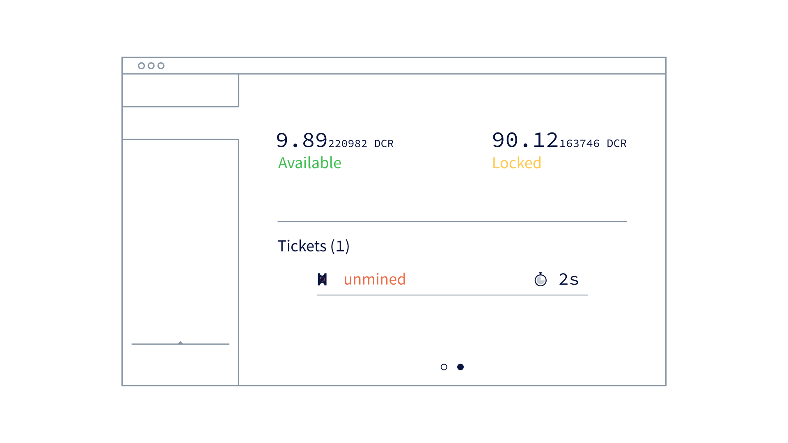
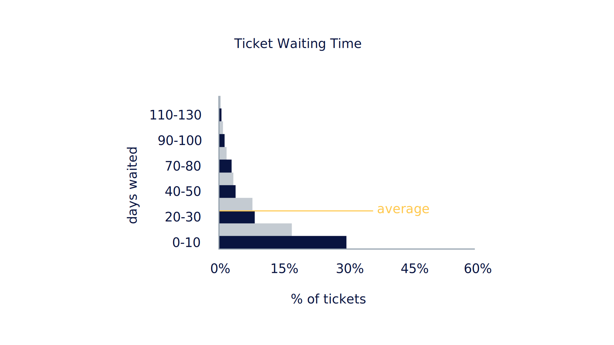
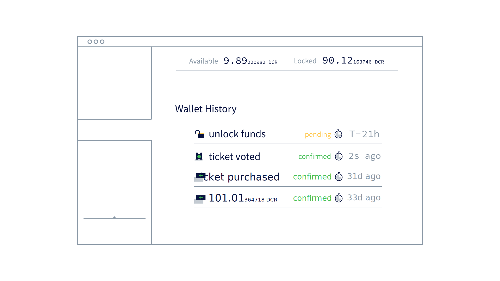
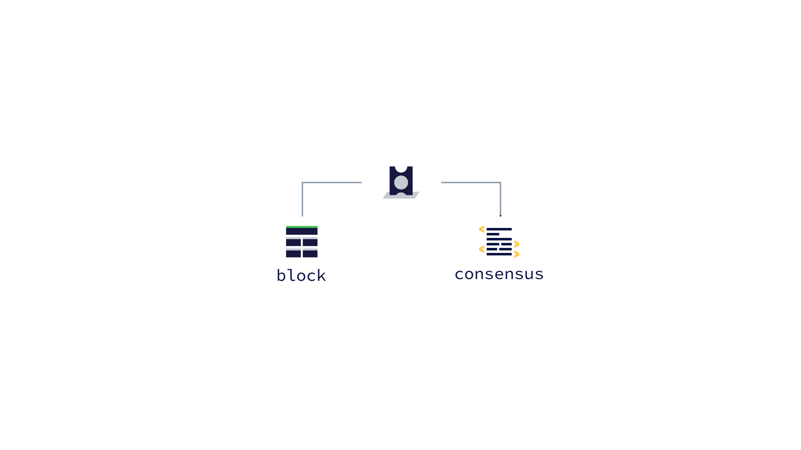

## Decred: Proof-of-Stake

### Storyboard
**Estimated Runtime:** 03:20

**Transition Style:**
If following scene has one or more of the same icons, then transition should serve to link the two scenes in some way. Otherwise, a simple "blink" on/off transition can be used.

No. | VISUAL | DESCRIPTION | TIME
:-: | :----: | :---- | :--:
1 |  | **VO:** Decred Proof-of-stake **action:** Ticket icon is highlighted. | 00:03 
2 |  | **VO:** is an on-chain decision making system **action:** "on-chain" and block icon appear first then "decision" and votes icon. They are then connected by the line. | 00:07 
3 |  | **VO:** Where participants purchase tickets for a chance to have their voice heard. **action:** Wallet icon appears pushing the schematic to the left, followed by the purchase ticket icon, pushing the schematic down. A line connects them and the schematic cycles. | 00:12 
4 |  | **VO:** to purchase a ticket, participants must have enough Decred to cover the current ticket price. **action:** `purchase ticket` button and icon are grey. `Available` counts up from zero. Then `ticket price`. `Purchase Ticket` button and icon turn green. | 00:21 
5 |  | **VO:** The price of a ticket is determined every 144 blocks by an algorithm designed to keep the total number of live tickets equal to the target size. **action:** Timer counts up to 144 blocks and activates the algorithm. Price is lowered. Timer counts up again, then price is increased. | 00:32 
6 |  | **VO:** If the participant's balance is high enough, a portion equal to the current ticket price may be locked in exchange for a ticket.  **action:** Purchase ticket button is pressed. purchase ticket screen slides to the left to show the tickets screen. `availabe` is subtracted by `ticket price.` `Locked` counts up. Ticket record slides up. Timer counts up in seconds. | 00:42 
7 | Send tx view wireframe showing `total balance` and `spendable balance` | **VO:** Locked funds can not be spent for the life of the corresponding ticket. **action:** A tx with an amount less than the total balance but greater than the spendable balance is attempted. An error message appears saying `insufficient spendable funds` | 00:48 
8 |  | **VO:** How long a ticket must wait to vote is entirely up to chance, but averages 30 days. **action:** Bars slide in from left one by one, from bottom to top. Then average line. | 00:56 
9 |  | **VO:** A ticket's life begins after it is mined into a block. How long a ticket must wait to be mined is determined by the transaction fee paid when it was purchased. Once included in a block, a ticket is considered immature and must wait about 12 hours before it becomes live and is added to the ticket pool. **action:** 1st half draws out and cycles, then emphasis on tx fee. Second half draws out. Entire schematic cycles. Timer counts up to 12 hours. | 01:18 
10 | Ticket pool dice-like interface and timer. | **VO:** The ticket pool is where live tickets wait to be chosen to vote. Every 5 minutes, using arbitrary entropy from the blockchain, 5 tickets are randomly drawn from the pool to vote. **action:** Timer counts up to 5 minutes. 5 tickets are randomly selected from the pool. | 01:31 
11 | Network map with VSPs differentiated from 'normal' nodes. | **VO:** Once their ticket is drawn, a participant's votes are broadcast to the network by their chosen voting service provider for inclusion in the next block. **action:** Votes are broadcast to the network from VSPs changing the map's color. | 01:45 
12 |  | **VO:** There are two on-chain voting processes to participate in: block votes and consensus votes. **action:**  | 01:54 
13 |  | **VO:** Block votes provide a mechanism for participants to keep nonconforming proof-of-work miners in check. **action:** schematic quickly 'cycles' multiple times over duration. | 02:01 
14 |  | **VO:** 5 votes in each new block decide whether to reject the previous block. If the block is rejected, the founding miner will not receive their part of the block reward. **action:** Blocks are added voting the previous block yes/no for the duration. `if yes` portion of schematic highlighted when yes signaled, block is greyed out when no. | 02:12 
15 |  | **VO:** Consensus voting is a two stage process where participants vote for or against the implementation of changes to the Decred network. **action:**  Schematic 'cycles' slowly. | 02:20 
16 |  | **VO:** if enough nodes upgrade within the upgrade phase interval, voting commences. If 75% of votes signal yes within the voting interval, then the changes are ratified and will be automatically implemented after another block interval. **action:** schematic cycles slowly. Timer counts up as top line is drawn. | 02:36 
17 |  | **VO:**  After a participant's block and consensus votes have been cast, followed by a 12 hour waiting period, the funds used to purchase the ticket are unlocked and a portion of the block reward is credited to their account. **action:** An event:  `ticket voted` is added. A Timer counts up to 12 hours. Then two pending events: `unlock funds` and `recieve reward ` are added. Timers on the pending events count up to 12 hours after which they initiate. `Spendable balance` counts up to `locked balance` + `reward` while `locked balance` goes to zero. | 02:47 
18 |  | **VO:** Other decisions not involving consensus rule changes, such as how to spend the network treasury are decided through Politeia, the Decred proposal system. **action:** schematic cycles at medium speed. | 02:57 
19 |  | **VO:** Through their wallet, participants with live tickets can vote to approve or deny Politeia proposals. **action** Votes are cast for each active proposal. | 03:04 
20 |  | **VO:** To begin participating in Decred proof-of-stake | 03:08 
21 |  | **VO:** download Decrediton at Decred.org | 03:12 
22 |  | **VO:** and purchase Decred at any one of the many supporting exchanges. | 03:17 
23 |  | **VO:** Decred; Decentralized Credits. | 03:20 
